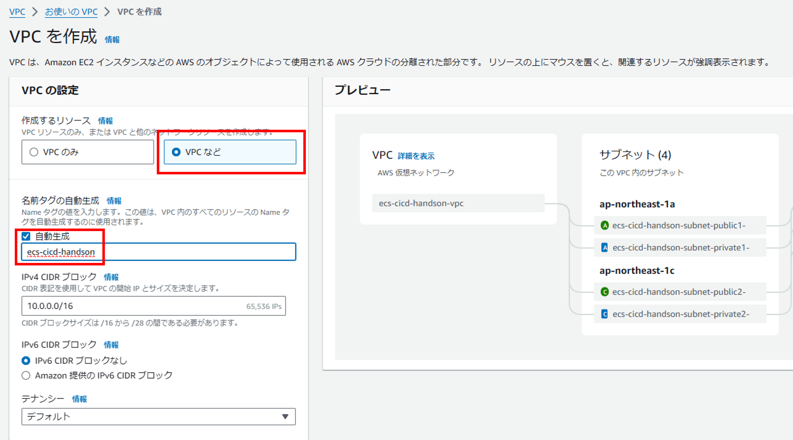
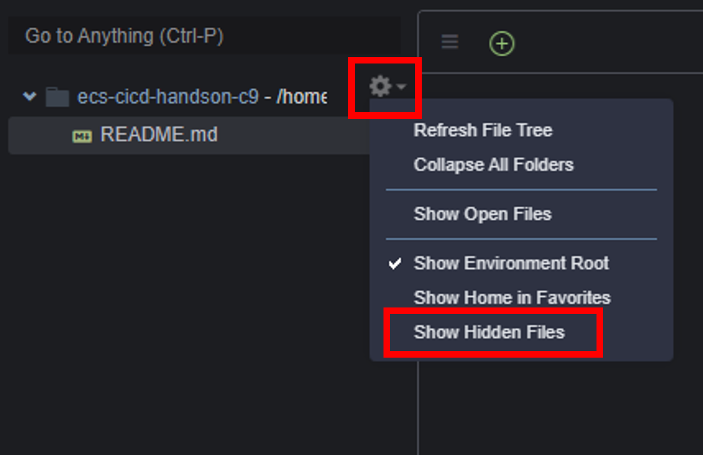
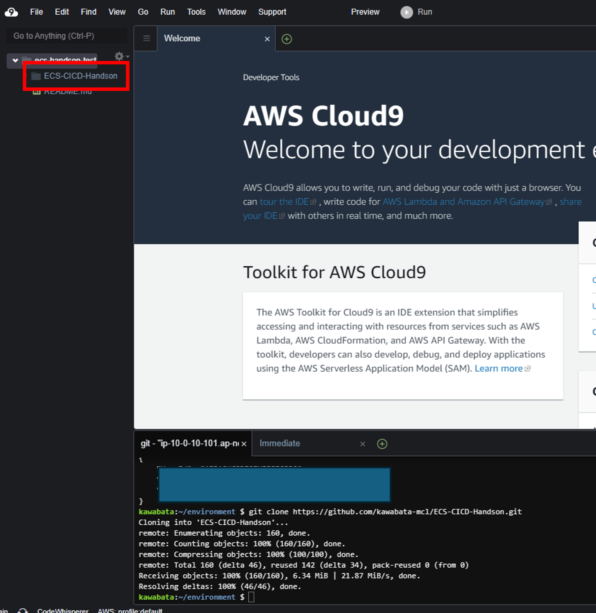
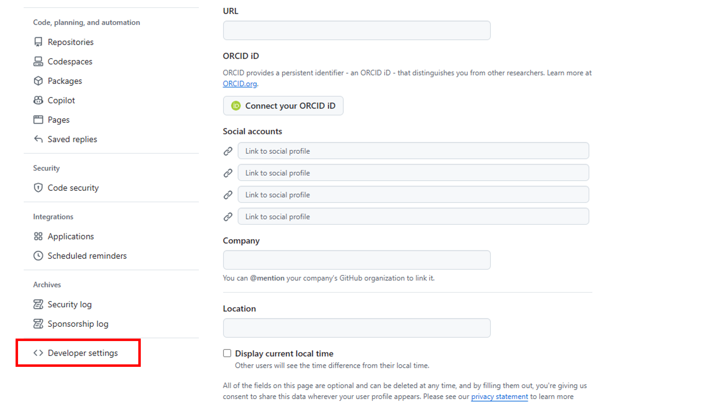
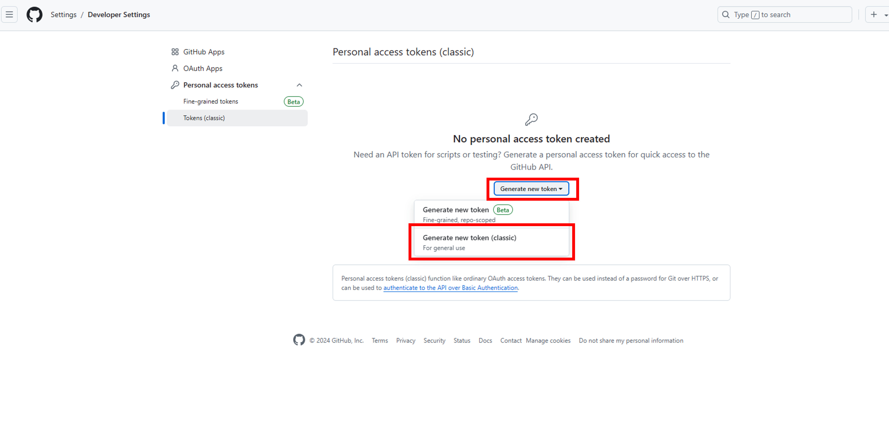
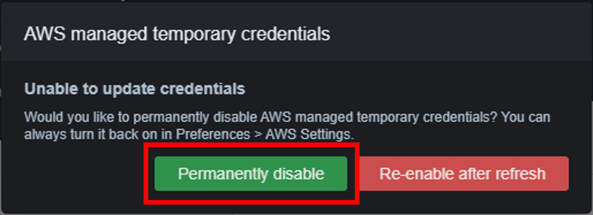

# 開発環境の準備

ソースコードの開発を進める環境を準備していきます。
VS Codeなどでローカルで開発できる環境がある方はそちらを利用しても問題ありません。

## 準備する環境

- GitHubアカウント
- gitとAWS CLIが利用できるIDE（VS Code、CLoud9など）  
以下コマンドで各バージョンが表示されるか確認してください
```
git --version
aws --version
```
- AWS Profile  
以下コマンドで`Account`のidと`Arn`が利用するアカウントid、利用するIAMユーザーのarnになっていることを確認してください
```
aws sts get-caller-identity
```

## 環境構築
### 1. Cloud9の作成

1. VPCを作成します。  
https://ap-northeast-1.console.aws.amazon.com/vpcconsole/home?region=ap-northeast-1#vpcs:
- 作成するリソースで`VPCなど`を選択
- 名前タグの自動生成に`ecs-cicd-handson`を入力
- それ以外はデフォルトで作成


2. Cloud9を作成します。  
https://ap-northeast-1.console.aws.amazon.com/cloud9control/home?region=ap-northeast-1#/
- 名前に`ecs-cicd-handson-c9`を入力
- インスタンスタイプで`t3.small`を選択
- 接続で`セキュアシェル (SSH)`を選択
- VPCで`ecs-cicd-handson-vpc`を選択
- サブネットで任意のパブリックサブネットを選択


3. Cloud9に接続します。
`開く`を押して、Cloud9が開けることを確認します


4. フォルダ構成が表示されているところの`歯車マーク`を押して、`Show Hidden Files`を選択します。



### 2. リポジトリをforkして、開発環境にcloneする

1. 以下リポジトリにアクセスして、右上の`Fork`を押します。  
https://github.com/CloudBuilders-Training/ECS-CICD-Handson


2. `Owner`で`自分のアカウント`を指定して、`Create fork`を押します。


3. 自分のアカウント配下にリポジトリをforkできたら、`Code`を押して、`HTTPS`のリンクをコピーします。


4. 開発環境上で以下コマンドを実行します。
```
git clone https://github.com/[自分のGitHubアカウント名]/ECS-CICD-Handson.git
```
すると以下のようCloud9上で`ECS-CICD-Handson`のフォルダが作成されます。



5. Cloneしたリポジトリに移動します。
```
cd ECS-CICD-Handson/
```

### GitHubでPersonal access tokensの設定

1. Githubの右上にある`自分のアイコン`を押して、`Settings`を選択します。


2. 下にスクロールし、左ペインの`Developer settings`を押します。


3. 左ペインの`Personal access tokens` -> `Tokens (classic)`の順で押します。


4. 真ん中の`Generate new token` -> `Generate new token (classic)`の順で押します。


5. 以下を設定して、`Generate token`を押します。
- Noteに`GitHub Actions Handson`と記載
- `repo`と`workflow`にチェック


6. terminalで以下コマンドを実行します。  
<アカウント名>と<アクセストークン>はそれぞれ書き換えて実行してください。
```
git remote set-url origin https://<アカウント名>:<アクセストークン>@github.com/<アカウント名>/ECS-CICD-Handson.git
```
### 3. AWS Profileの設定

terminalでAWS CLIを実行するAWS Profileの設定ができていない方は実施してください。

1. 自分のAWSアカウントにログインし、アクセスキーを発行するIAMユーザーを選択します  
https://us-east-1.console.aws.amazon.com/iam/home?region=ap-northeast-1#/users

2. `セキュリティ認証情報`を選択し、`アクセスキーを作成`を押します。

3. `コマンドラインインターフェース（CLI）`を選択し、確認事項にチェックを入れて`次へ`を押します。

4. `アクセスキーを作成`を押します。

5. `アクセスキー`、`シークレットアクセスキー`が表示されるのでコピーし、`.csvファイルをダウンロード`を押して、`完了`を押します。

6. 開発環境のターミナルで以下コマンドを順次実行します。

AWS CLIをインストールしていない場合は、以下ドキュメントを参考にインストールしてください。  
https://docs.aws.amazon.com/ja_jp/cli/latest/userguide/getting-started-install.html

- AWS Profile設定
```
aws configure --profile ecs-cicd-handson
```
設定値は以下です。
```
AWS Access Key ID [None]: 取得したアクセスキー
AWS Secret Access Key [None]: 取得したシークレットアクセスキー
Default region name [None]: ap-northeast-1
Default output format [None]: json
```

※Cloud9で設定している場合、ポップアップウィンドウが表示されるので`Cancel` -> `Permanently disable`を押してください。


- AWS Profile切替
```
export AWS_PROFILE=ecs-cicd-handson
```

- AWS Profile設定確認
```
aws sts get-caller-identity
```
`Account`のidと`Arn`がアクセスキーを発行したユーザーのarnになっているか確認します。

以上で準備完了です。

## 手順一覧

1. [開発環境の準備](../10_開発環境の準備/environment_preparation.md)
2. [**OIDCの設定**](../20_OIDCの設定/setting_OIDC.md)←次の手順です
3. [リソースのデプロイ](../30_リソースのデプロイ/deploy_resource.md)
4. [ECSへのコンテナデプロイ](../40_ECSへのコンテナデプロイ/deploy_container.md)
5. [セキュリティの実装](../50_セキュリティの実装/security_scan.md)
6. [リソースの削除](../60_リソースの削除/delete_resource.md)
