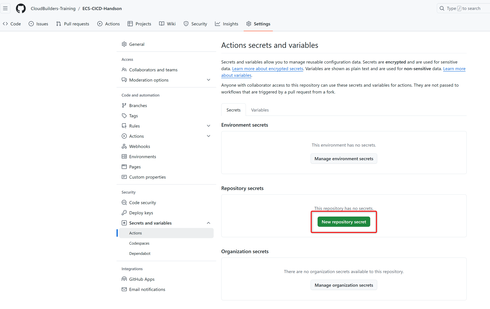

# OIDCの設定

ここでは、GitHub側からAWSのリソースにアクセスするための信頼関係の設定を行います。  
静的クレデンシャルであるIAMユーザのアクセスキーを利用する方法もありますが、定期的にローテーションが行われなれば、漏洩した際の被害が大きくなりやすいです。
そのため、GitHubとAWS感の信頼関係の確立には、一時クレデンシャルを活用することが推奨となります。

一時クレデンシャルの取得で利用されるのが**OIDC**(**OpenID Connect**)です。  
OIDCでは、GitHub側で生成したトークンをAWS側で発行する一時クレデンシャルと交換します。
ただ、このトークンをなんでもかんでも信頼してAWS側は一時クレデンシャルと交換しているわけではなく、予めこのトークンの発行元を信頼する設定をしておく必要があります。

トークンはGitHubが運用している**GitHub OIDC Provider**で生成されます。これをAWS側では、**OpenID Connect Provider**で信頼する設定を行うことができます。

OIDCの設定を行い、実際にGitHub Actionsを使ってAWSのリソースへアクセスすることが目標となります。  

## OpenID Connect Providerの作成

初めにAWS側でOpenID Connect Providerを作成します。
CloudShell等を開き、下記コマンドを実行してください。

```bash
aws iam create-open-id-connect-provider \
  --url https://token.actions.githubusercontent.com \
  --client-id-list sts.amazonaws.com \
  --thumbprint-list 1234567890123456789012345678901234567890
```

`url`フラグでは、トークンを生成するシステム(Identity Provider)のURLを指定します。今回は、GitHub OIDC Providerを指定しています。  
`client-id-list`フラグでは、トークンと一時クレデンシャルを交換するシステムを指定します。今回は、sts.amazonaws.comを指定しています。  
`thumbprint-list`フラグでは、OIDCプロバイダーのSSL/TLS証明書のハッシュ値を指定します。GitHub OIDC Providerでは指定する必要がないので適当な値を指定しています。

## IAMロールの作成

続いてGitHubがAWSリソースにアクセスする際に使用するロールを作成します。

### 変数の設定

後の信頼関係ポリシーの作成のためリポジトリ名とアカウントIDを変数に設定します。  

```bash
export GITHUB_REPOSITORY=$(git remote get-url origin|sed -E 's|^.*[:/]([^/]+/[^/]+)\.git$|\1|')
export AWS_ID=$(aws sts get-caller-identity --query Account --output text)
```

### 信頼関係ポリシーの作成

信頼関係ポリシーを作成します。  

```bash
cat <<EOF > assume_role_policy.json
{
  "Version": "2012-10-17",
  "Statement": [
    {
      "Effect": "Allow",
      "Action": "sts:AssumeRoleWithWebIdentity",
      "Principal": {
        "Federated": "arn:aws:iam::${AWS_ID}:oidc-provider/token.actions.githubusercontent.com"
      },
      "Condition": {
        "StringLike": {
          "token.actions.githubusercontent.com:sub": "repo:${GITHUB_REPOSITORY}:*"
        }
      }
    }
  ]
}
EOF
```

`Principal`にて先ほど作成したOpenID Connect Providerを指定しています。  
また、このままではGitHub OIDC ProvidcerへのOIDCトークンを取得することで誰でもアクセス可能になってしまうので  
 `Condition`にてOIDCトークン内に含まれるリポジトリ名を条件のキーとして指定しています。

### ロールの作成

`github-actions-role`という名前でロールを作成します。  

```bash
aws iam create-role \
  --role-name github-actions-role \
  --assume-role-policy-document file://assume_role_policy.json
```

この後、GitHub ActionsのテストとしてIAMのロール一覧を出力する処理を実行するのでマネージドポリシーの `IAMReadOnlyAccess`をアタッチします。

```bash
aws iam attach-role-policy --role-name github-actions-role --policy-arn arn:aws:iam::aws:policy/IAMReadOnlyAccess
```

ロールの作成が完了したらAWS側での準備は終了です。

## Secretの登録

GitHub Actionを実行するためには、`.github/workflow`配下にワークフローの設定ファイルを設置する必要があります。  
この配下のファイルにGitHub Actionsで実行したい処理を書いていきますが例えばAPIキーなどといった機密情報をファイルの中で扱うこともあります。
そうした情報は`Secret`に保存することで外部に公開することを防ぐことができます。  

`Secret`に保存することにより、値は暗号化して管理され保存後、値を確認することができなくなります。
また、**GitHub Actions実行時のログ出力時にも値がマスク**されるので情報を安全に扱うことができます。

`.github/workflow/OIDC-test.yml`を開いて見てください。4行目に次のような記述があります。

```text
ROLE_ARN: arn:aws:iam::${{ secrets.AWS_ID }}:role/${{ secrets.ROLE_NAME }}
```

`Secret`に保存した情報は`${{ secrets.変数名 }}`といった形式で参照することができます。

ここでは、AWSのアカウントIDとロール名を`Secret`から参照しています。  

この2つの情報を`Secret`に保存します。

1. ブラウザ上でリポジトリを開き、上側のタブから`Setting`をクリックし画面が遷移したら左のタブから`Secrets and variables`→`Actions`を選択します。


2. 下記画面が開けたら、`New repository secret`を押下します。


3. `Name`に`ROLE_NAME`、`Secret`に`github-actions-role`と入力して`Add secret`を押下してください。
これで、ロール名は保存完了です。


4. 同様に`AWS_ID`という名前でアカウントIDを保存してください。

## GitHub Actionsの動作確認

OIDCの設定は完了したので、実際にGitHub Actionsのワークフローを動作させてみます。
確認のため動作としては、アカウント内のIAMポリシーの一覧を出力するのみとなります。

1. ブラウザ上でリポジトリを開き、上側のタブから`Actions`をクリックし画面が遷移したら左のタブから`1 OpenID Connectのテスト`を選択します。

2. 右側の`Run workflow`をクリックし緑色の`Run workflow`のボタンをクリックするとワークフローが始まります。'
3. 少し待つとワークフローが表示されます。`1 OpenID Connectのテスト`をクリックしてみてください。

4. 下記のような表示になるので`connect`をクリックしてみてください。

5. `Run aws iam list-policies --scope Local`をクリックしてみると下記画像のようにポリシー一覧が出力されます。  
ここで出力の中の`Arn`の項目を確認すると`arn:aws:iam:***:policy/`となっています。`***`の部分は本来アカウントIDが入りますが、アカウントIDは`Secret`に登録している情報となるのでログに出力されないようにマスクされています。


## GitHub Actionsについて

- [GitHub Actionsの概要](https://docs.github.com/ja/actions/about-github-actions/understanding-github-actions)
- [ワークフローについて](https://docs.github.com/ja/actions/writing-workflows/about-workflows)
- [ワークフロー構文](https://docs.github.com/ja/actions/writing-workflows/workflow-syntax-for-github-actions)
