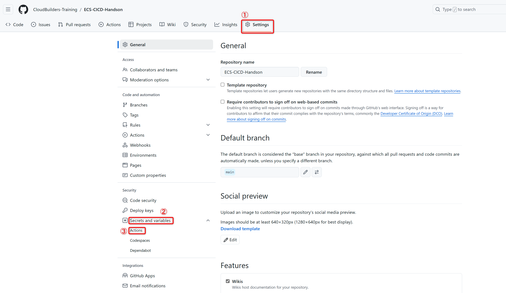
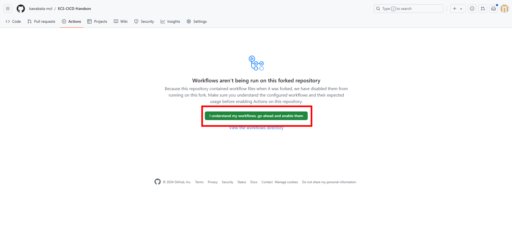

# OIDCの設定

ここでは、GitHub側からAWSのリソースにアクセスするための信頼関係の設定を行います。  
静的クレデンシャルであるIAMユーザのアクセスキーを利用する方法もありますが、定期的にローテーションが行われなれば、漏洩した際の被害が大きくなりやすいです。
そのため、GitHubとAWS間の信頼関係の確立には、一時クレデンシャルを活用することが推奨となります。

一時クレデンシャルの取得で利用されるのが**OIDC**(**OpenID Connect**)です。  
OIDCでは、GitHub側で生成したトークンをAWS側で発行する一時クレデンシャルと交換します。
ただ、このトークンをなんでもかんでも信頼してAWS側は一時クレデンシャルと交換しているわけではなく、予めこのトークンの発行元を信頼する設定をしておく必要があります。

トークンはGitHubが運用している**GitHub OIDC Provider**で生成されます。これをAWS側では、**OpenID Connect Provider**で信頼する設定を行うことができます。

OIDCの設定を行い、実際にGitHub Actionsを使ってAWSのリソースへアクセスすることが目標となります。  

## OpenID Connect Providerの作成

初めにAWS側でOpenID Connect Providerを作成します。
CloudShell等を開き、下記コマンドを実行してください。

```bash
aws iam create-open-id-connect-provider \
  --url https://token.actions.githubusercontent.com \
  --client-id-list sts.amazonaws.com \
  --thumbprint-list 1234567890123456789012345678901234567890
```

`url`フラグでは、トークンを生成するシステム(Identity Provider)のURLを指定します。今回は、GitHub OIDC Providerを指定しています。  
`client-id-list`フラグでは、トークンと一時クレデンシャルを交換するシステムを指定します。今回は、sts.amazonaws.comを指定しています。  
`thumbprint-list`フラグでは、OIDCプロバイダーのSSL/TLS証明書のハッシュ値を指定します。GitHub OIDC Providerでは指定する必要がないので適当な値を指定しています。

## IAMロールの作成

続いてGitHubがAWSリソースにアクセスする際に使用するロールを作成します。

### 変数の設定

後の信頼関係ポリシーの作成のためリポジトリ名とアカウントIDを変数に設定します。  

```bash
export GITHUB_REPOSITORY=$(git remote get-url origin|sed -E 's|^.*[:/]([^/]+/[^/]+)\.git$|\1|')
export AWS_ID=$(aws sts get-caller-identity --query Account --output text)
```

### 信頼関係ポリシーの作成

信頼関係ポリシーを作成します。  

```bash
cat <<EOF > assume_role_policy.json
{
  "Version": "2012-10-17",
  "Statement": [
    {
      "Effect": "Allow",
      "Action": "sts:AssumeRoleWithWebIdentity",
      "Principal": {
        "Federated": "arn:aws:iam::${AWS_ID}:oidc-provider/token.actions.githubusercontent.com"
      },
      "Condition": {
        "StringLike": {
          "token.actions.githubusercontent.com:sub": "repo:${GITHUB_REPOSITORY}:*"
        }
      }
    }
  ]
}
EOF
```

`Principal`にて先ほど作成したOpenID Connect Providerを指定しています。  
また、このままではGitHub OIDC ProvidcerへのOIDCトークンを取得することで誰でもアクセス可能になってしまうので  
 `Condition`にてOIDCトークン内に含まれるリポジトリ名を条件のキーとして指定しています。

### ロールの作成

先ほど作成した信頼関係ポリシーを使って、`github-actions-role`という名前でロールを作成します。  

```bash
aws iam create-role \
  --role-name github-actions-role \
  --assume-role-policy-document file://assume_role_policy.json
```

この後、GitHub ActionsのテストとしてIAMのロール一覧を出力する処理を実行するのでマネージドポリシーの `IAMReadOnlyAccess`をアタッチします。

```bash
aws iam attach-role-policy --role-name github-actions-role --policy-arn arn:aws:iam::aws:policy/IAMReadOnlyAccess
```

ロールの作成が完了したらAWS側での準備は終了です。

## Secretの登録

GitHub Actionsを実行するためには、`.github/workflow`配下にワークフローの設定ファイルを設置する必要があります。  
この配下のファイルにGitHub Actionsで実行したい処理を書いていきますが例えばAPIキーなどといった機密情報をファイルの中で扱うこともあります。
そうした情報は`Secret`に保存することで外部に公開することを防ぐことができます。  

`Secret`に保存することにより、値は暗号化して管理され保存後、値を確認することができなくなります。
また、**GitHub Actions実行時のログ出力時にも値がマスク**されるので情報を安全に扱うことができます。

`.github/workflow/OIDC-test.yml`を開いて見てください。4行目に次のような記述があります。

```text
ROLE_ARN: arn:aws:iam::${{ secrets.AWS_ID }}:role/${{ secrets.ROLE_NAME }}
```

`Secret`に保存した情報は`${{ secrets.変数名 }}`といった形式で参照することができます。

ここでは、AWSのアカウントIDとロール名を`Secret`から参照しています。  

この2つの情報を`Secret`に保存します。

1. ブラウザ上でリポジトリを開き、上側のタブから`Setting`をクリックし画面が遷移したら左のタブから`Secrets and variables`→`Actions`を選択します。


2. 下記画面が開けたら、`New repository secret`を押下します。


3. `Name`に`ROLE_NAME`、`Secret`に`github-actions-role`と入力して`Add secret`を押下してください。
これで、ロール名は保存完了です。


4. 同様に`AWS_ID`という名前でアカウントIDを保存してください。

## GitHub Actionsの動作確認

OIDCの設定は完了したので、実際にGitHub Actionsのワークフローを動作させてみます。
確認のため動作としては、アカウント内のIAMポリシーの一覧を出力するのみとなります。

1. ブラウザ上でリポジトリを開き、上側のタブから`Actions`をクリックし画面が遷移したら左のタブから`1 OpenID Connectのテスト`を選択します。
※`Actinos`を初めて開く際に、workflowsの実行を許可するか聞かれるので許可してください。


2. 右側の`Run workflow`をクリックし緑色の`Run workflow`のボタンをクリックするとワークフローが始まります。'
3. 少し待つとワークフローが表示されます。`1 OpenID Connectのテスト`をクリックしてみてください。

4. 下記のような表示になるので`connect`をクリックしてみてください。

5. `Run aws iam list-policies --scope Local`をクリックしてみると下記画像のようにポリシー一覧が出力されます。  
ここで出力の中の`Arn`の項目を確認すると`arn:aws:iam:***:policy/`となっています。`***`の部分は本来アカウントIDが入りますが、アカウントIDは`Secret`に登録している情報となるのでログに出力されないようにマスクされています。


## GitHub Actionsについて

`GitHub Actions` は、ビルド、テスト、デプロイのパイプラインを自動化できるCI/CD(継続的インテグレーションと継続的デリバリー) のプラットフォームです。  
今回はリポジトリにプッシュされたタイミングや手動にてGitHub Actionsを動作させAWSのリソースを編集するといったことを行いますが、他にも例えばリポジトリでissueが作成された際に自動的にラベル付けをするといったことをさせることも可能です。

### GitHub Actionsの要素

GitHub Actionsの要素として下記のようなものがあります。

- `ワークフロー`：GitHub Actionsにて実行されるプロセス
- `イベント`：ワークフローのトリガー
- `ジョブ`：ワークフロー内で実行される一連のステップ
- `アクション`：タスクを1つのステップにまとめたもの
- `ランナー`；ワークフローが実行される際にジョブ単位で動作するサーバ

#### ワークフロー

ワークフローとは、**1 つ以上のジョブを実行する**構成可能な自動化プロセスです。ワークフローは、リポジトリ内の `.github/workflows`ディレクトリにて定義されます。  
先ほど実行した `1 OpenID Connectのテスト`が`.github/workflows/10_OIDC-test.yml`で定義されているワークフローです。  

`.github/workflows/10_OIDC-test.yml`のようなファイルを**ワークフローファイル**と呼びます。  
ワークフローファイルでは、後述のイベントやジョブなどが定義されています。

#### イベント

イベントとは、**ワークフローの実行をトリガーする**リポジトリ内の特定のアクティビティです。  
ワークフローとは、1 つ以上のジョブを実行する構成可能な自動化プロセスです。

ワークフローファイルでは、`on:`というキーで定義します。  
`.github/workflows/10_OIDC-test.yml`では、下記のように定義されています。

```yaml
on: workflow_dispatch
```

`workflow_dispatch`では先ほどのように手動でトリガー(手動で開始)された際に実行されます。  
他にも例えば `on: push`と指定することができ、これはリポジトリにプッシュされた際にワークフローが実行されます。  

詳しくは[ワークフローをトリガーするイベント](https://docs.github.com/ja/actions/writing-workflows/choosing-when-your-workflow-runs/events-that-trigger-workflows)を参照してください。

#### ジョブ

ジョブとは、同じランナーで実行される**ワークフロー内の一連のステップ**です。各ステップは`jobs.<job_id>.steps`キーで定義されます。  
`.github/workflows/10_OIDC-test.yml`ではjob_idを`connect`として下記の2つのステップがあります。

```yaml
- uses: aws-actions/configure-aws-credentials@v4 # AWSの認証アクション
  with:
    role-to-assume: ${{ env.ROLE_ARN }}
    role-session-name: ${{ env.SESSION_NAME }}
    aws-region: ap-northeast-1

- run: aws iam list-policies --scope Local                        # 一時クレデンシャルの利用
```

1つ目の`uses`キーでは後述のアクションを実行しており、ここではAWSの公式のアクションを使用してAWSのクレデンシャルの設定を行っています。
2つ目の`run`キーではOSのシェルを使用してCLIコマンドを実行しており、IAMのポリシー一覧を表示しています。  

#### アクション

アクションとは、複雑で頻繁に実行される**タスクを1つのステップにまとめたもの**でコードの量を削減するのに役立ちます。  
アクションには独自で記載したものに加え、GitHub Marketplaceにて公開されたものを使用することもできます。

先述したように`.github/workflows/10_OIDC-test.yml`では下記の記載にてアクションを呼び出しています。

```yaml
- uses: aws-actions/configure-aws-credentials@v4 # AWSの認証アクション
  with:
    role-to-assume: ${{ env.ROLE_ARN }}
    role-session-name: ${{ env.SESSION_NAME }}
    aws-region: ap-northeast-1
```

このアクションは[リポジトリ`aws-actions/configure-aws-credentials`](https://github.com/aws-actions/configure-aws-credentials/tree/main)にて定義されています。  
今回は本リポジトリ内で定義したアクションも使用しますが、アクションを活用することにより簡単に複雑な自動化プロセスを作成することが可能となります。

アクションの公開については[こちら](https://docs.github.com/ja/actions/sharing-automations/creating-actions/publishing-actions-in-github-marketplace)を確認してみてください。

#### ランナー

ランナーとは、**ワークフローがトリガーされると実行されるサーバ**です。ランナーは`jobs.<job_id>.runs-on`キーで定義されます。  
`.github/workflows/10_OIDC-test.yml`では、下記のように定義されています。

```yaml
runs-on: ubuntu-latest
```

`ubuntu-latest`と指定しており`Ubuntu`内にてワークフローが実行されています。  

ランナーには、`GitHub-Hosted Runners`もしくは`Self-Hosted Runners`を指定できます。  
`GitHub-Hosted Runners`はGitHubが提供するマネージドな実行環境で`ubuntu-latest`もその一つです。  
`Self-Hosted Runners`は利用者が用意した実行環境です。今回は使用しません。  

GitHub-Hosted RunnersはLinuxの他にもMacやWindowsを指定することができます。  
詳細は[こちら](https://docs.github.com/ja/actions/writing-workflows/workflow-syntax-for-github-actions#%E3%83%91%E3%83%96%E3%83%AA%E3%83%83%E3%82%AF-%E3%83%AA%E3%83%9D%E3%82%B8%E3%83%88%E3%83%AA%E3%81%AE%E6%A8%99%E6%BA%96%E3%81%AE-github-%E3%81%A7%E3%83%9B%E3%82%B9%E3%83%88%E3%81%95%E3%82%8C%E3%81%9F%E3%83%A9%E3%83%B3%E3%83%8A%E3%83%BC)を確認してみてください。

以上でGitHub Actionsの説明について終わります。

### 参考

- [GitHub Actionsの概要](https://docs.github.com/ja/actions/about-github-actions/understanding-github-actions)
- [ワークフローについて](https://docs.github.com/ja/actions/writing-workflows/about-workflows)
- [ワークフロー構文](https://docs.github.com/ja/actions/writing-workflows/workflow-syntax-for-github-actions)
  - [jobs.<job_id>.steps](https://docs.github.com/ja/actions/writing-workflows/workflow-syntax-for-github-actions#jobsjob_idsteps)

## 手順一覧

1. [開発環境の準備](./document/10_開発環境の準備/environment_preparation.md)
2. [OIDCの設定](./document/20_OIDCの設定/setting_OIDC.md)
3. [**リソースのデプロイ**](./document/30_リソースのデプロイ/deploy_resource.md)←次の手順です
4. [ECSへのコンテナデプロイ](./document/40_ECSへのコンテナデプロイ/deploy_container.md)
5. [セキュリティの実装](./document/50_セキュリティの実装/security_scan.md)
6. [リソースの削除](./document/60_リソースの削除/delete_resource.md)
