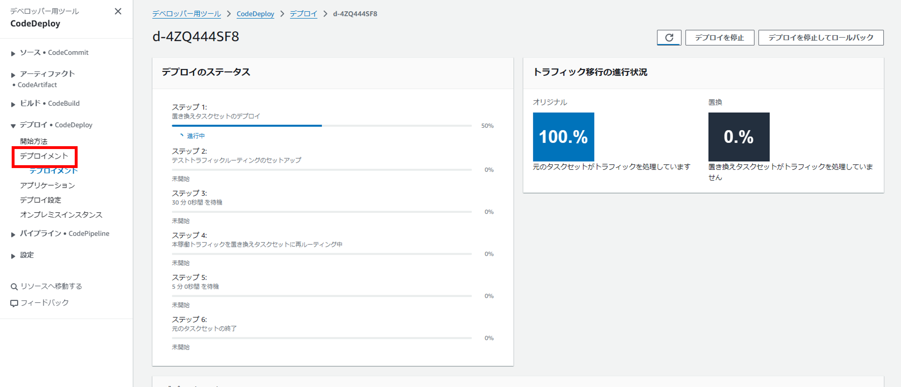
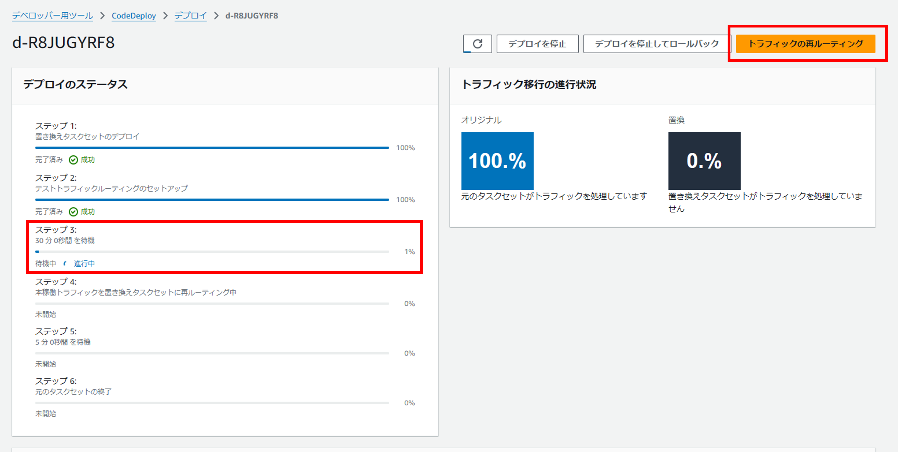
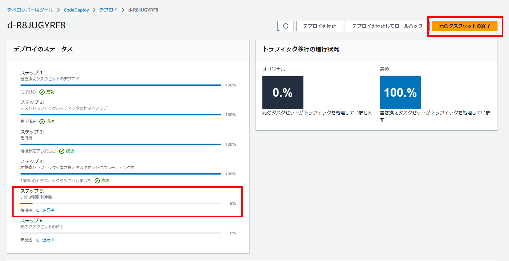

# ECSへのコンテナのデプロイ

デプロイしたECSにコンテナをデプロイを行うためのGitHub Actionsのワークフローを作成することが目標となります。

はじめにワークフローを実行するためのポリシーをロールに付与します。

## IAMポリシーの作成

ポリシーは`AWS/iam_policy/deploy_ecs_task_policy.json`に用意しています。
このファイルを使用してポリシーを作成します。

```bash
aws iam create-policy --policy-name deploy-ecs_task_policy --policy-document file://AWS/iam_policy/deploy_ecs_task_policy.json
```

## IAMロールへアタッチ

続いて上記で作成したポリシーを`github-actions-role`にアタッチします。

```bash
aws iam attach-role-policy --role-name github-action-role --policy-arn arn:aws:iam::${AWS_ID}:policy/deploy_ecs_task_policy
```

## ワークフローファイルの作成

ここから皆さんに色々調べてもらいながらファイルを作成します。

予め、ワークフローのファイルは用意しており今回はその中のファイルを編集してワークフローを完成させていただきます。  
今回使用するファイルは、下記の3ファイルになります。各ファイルを開いてみてください。  

```text
.github
├── actions
│   ├── container-build
│   │   └── action.yml
│   └── container-deploy
│       └── action.yml
└── workflows
    └── 30_ecs-task-deploy.yml
```

まず、`.github/workflows/30_ecs-task-deploy.yml`についてです。こちらのファイルは`.github/workflow`配下のファイルとなるので、ワークフローはこちらから実行されます。そのため、ワークフローの全体の流れを定義しているファイルとなります。  

ここで着目していただきたい記載が24行目と30行目になります。

【24行目】

```yaml
- uses: ./.github/actions/container-build/
```

【30行目】

```yaml
- uses: ./.github/actions/container-deploy/
```

それぞれ、カレントディレクトリから今回扱う残りの2ファイルへのパスとなっています。  
これらは残りの2ファイルで定義されたタスクを呼び出しています。

24行目にて呼び出している`.github/workflows/container-build/action.yml`では、コンテナのビルドを行い、ECRにプッシュします。

30行目にて呼び出している`.github/workflows/contianer-deploy/action.yml`では、ECRのリポジトリからECSのタスク定義を更新し、ECSクラスターのサービスを更新しています。

ファイルの説明としては、以上となります。  
ここからは実際に先ほどデプロイしたリソースから必要な変数を設定したり、ワークフローファイルを編集していただきます。

### リポジトリ変数設定

`.github/workflows/30_ecs-task-deploy.yml`のステップ内の各タスクにて`with`という要素があります。  
こちらでは、タスクに対して変数を与えることができます。

例えば、下記のような記載があります。

【26~27行目】

```yaml
with:
  ecr-repository-uri: ${{ secrets.ECR_REPOSITORY_URL }}
```

`${{ secrets.ECR_REPOSITORY_URL }}` という記載では`Secret`に`ECR_REPOSITORY_URL`という名前で登録された値を参照しています。

OIDCの設定の際に登録したように、ワークフロー内で参照するための変数の設定を行ってください。  
対象となる変数名は下記になります。中には`Secrets`ではなく`Variables`として登録するものもあるので注意してください。  

- `ECR_REPOSITORY_URL`：ECRのリポジトリURLになります。
- `ECS_CLUSTER_NAME`：ECSクラスターの名前になります。
- `ECS_SERVICE_NAME`：ECSサービスの名前になります。上記のECSクラスター内にて確認できます。
- `TASK_DEFINITION_NAME`：タスク定義の名前になります。ECSのマネジメントコンソール上にて確認できます。
- `CONTAINER_NAME`：上記のタスク定義内にあるコンテナ名になります。
- `CODEDEPLOY_APPLICATION`：CodeDeployのアプリケーションの名前になります。
- `CODEDEPLOY_DEPLOYMENT_GROUP`：上記アプリケーション内にあるデプロイグループの名前になります。

### GitHubActionsのワークフローファイルの編集

以下ファイルの`###### ... ######`の項目に正しい処理を記載してください。  

- `.github/actions/container-build/action.yml`
- `.github/actions/container-deploy/action.yml`

ファイルの修正が完了したら、以下コマンドを順次実行して、リポジトリにpushしてください。  
コミットメッセージにはコードの修正内容がわかるようなメッセージを記載してください。  

```bash
git add .
git commit -m "コミットメッセージ"
git push -u origin main
```

pushをトリガーに`3 ECS タスクデプロイ`のworkflowが起動します。  
失敗したら内容を確認し、修正して再度pushしてください。

<details><summary>ヒント1</summary>

dockerのビルドコマンドは以下です。  
<dockerファイルのパス>と<タグ>をそれぞれ書き換えてください。
```
docker build -f <dockerファイルのパス> -t <タグ> .
```

</details>

<br>

<details><summary>ヒント2</summary>

dockerのプッシュコマンドは以下です。
<タグ>を書き換えてください。
```
docker push <タグ>
```

</details>

<br>

<details><summary>ヒント3</summary>

`.github/workflows/30_ecs-task-deploy.yml`の`container-image`のように、以前の処理で出力した内容を利用することができます。

</details>

## CodeDeployを実行してタスクを入れ替える

1. GitHub Actionsが正常に終了すると、CodeDeployが実行されるので、`CodeDeploy` -> `デプロイメント` -> `進行中のデプロイ`を押して確認します。  


2. ステップ3まで進むと、置き換えタスクセットが作成されるので、ALBの8080ポートにアクセスして、正常に閲覧できるかを確認します。  
**Hello Amazon ECS**が画面に表示されていれば成功です。

3. 右上の`トラフィックを再ルーティング`を押して、タスクセットの切り替えを実施します。


4. ステップ5まで進んだら`元のタスクセットの終了`を押します。


5. ALBの80ポートにアクセスして置き換えが完了していることを確認します。  
**Hello Amazon ECS**が画面に表示されていれば成功です。

### 参考リンク

- ビルド
  - [docker/metadata-action](https://github.com/docker/metadata-action)
  - [docker build](https://docs.docker.jp/engine/reference/commandline/build.html)
  - [docker push](https://docs.docker.jp/engine/reference/commandline/push.html)
- デプロイ
  - [amazon-ecs-deploy-task-definition](https://github.com/aws-actions/amazon-ecs-deploy-task-definition)

## 手順一覧

1. [開発環境の準備](./document/10_開発環境の準備/environment_preparation.md)
2. [OIDCの設定](./document/20_OIDCの設定/setting_OIDC.md)
3. [リソースのデプロイ](./document/30_リソースのデプロイ/deploy_resource.md)
4. [ECSへのコンテナデプロイ](./document/40_ECSへのコンテナデプロイ/deploy_container.md)
5. [セキュリティの実装](./document/50_セキュリティの実装/security_scan.md)←次の手順です
6. [リソースの削除](./document/60_リソースの削除/delete_resource.md)
